# 🎉 Hacktoberfest 2025: Elite Code, Innovation & Excellence 🚀

<div align="center">


<!-- ANIMATED TYPING EFFECT -->
<p align="center">
  
</p>

<!-- SNAKE ANIMATION -->
<picture>
  <source media="(prefers-color-scheme: dark)" srcset="https://raw.githubusercontent.com/platane/platane/output/github-contribution-grid-snake-dark.svg">
  <source media="(prefers-color-scheme: light)" srcset="https://raw.githubusercontent.com/platane/platane/output/github-contribution-grid-snake.svg">
  
</picture>

<!-- DYNAMIC BANNER -->


[](https://github.com/strivedi4u/Hacktoberfest2025/stargazers)
[](https://github.com/strivedi4u/Hacktoberfest2025/network/members)
[](https://github.com/strivedi4u?tab=followers)
[](https://github.com/strivedi4u/Hacktoberfest2025/issues)
[](https://github.com/strivedi4u/Hacktoberfest2025/pulls)
[](https://github.com/strivedi4u/Hacktoberfest2025/pulls?q=is%3Apr+is%3Aclosed)
[](https://github.com/strivedi4u/Hacktoberfest2025/graphs/contributors)
[](https://github.com/strivedi4u/Hacktoberfest2025/commits/main)
[](https://github.com/strivedi4u/Hacktoberfest2025)
[](https://github.com/strivedi4u/Hacktoberfest2025)
[](https://github.com/strivedi4u/Hacktoberfest2025/pulls)
[](https://hacktoberfest.com)

[](https://chat.whatsapp.com/JP5uGuNAS0f6ShuuanPh7E)
[](https://www.linkedin.com/in/strivedi4u/)
[](https://twitter.com/strivedi4u)

</div>

---

## 📊 Advanced Metrics Dashboard

<div align="center">

### 📌 Live Key Performance Indicators

| Metric | Live Value | Trend | Performance |
|--------|------------|-------|-------------|
| ⭠**Total Stars** |  | 📈 Growing |  |
| 🔱 **Total Forks** |  | 📈 Growing |  |
| 👥 **Contributors** |  | 📈 Growing |  |
| 🔄 **Open PRs** |  | 🔄 Active |  |
| ✅ **Merged PRs** |  | ✅ Success |  |
| 🛠**Open Issues** |  | 🔄 Active |  |
| ✔️ **Closed Issues** |  | ✅ Resolved |  |
| 📠**Code Size** |  | 📦 Optimized |  |
| 💾 **Total Commits** |  | 📈 Growing |  |
| 🏷️ **Latest Release** |  | 🚀 Updated |  |

### 🔥 Live Contribution Activity Heatmap


### 📊 Dynamic Language Distribution


### 🌟 Live Star History & Growth Trajectory

[](https://star-history.com/#strivedi4u/Hacktoberfest2025&Date)

</div>

---

## 📊 Ultra-Advanced Live Analytics & Real-Time Metrics

<div align="center">

### 🚀 Live Repository Performance Dashboard


### 🔥 Real-Time Contributor Leaderboard

[](https://github.com/strivedi4u/Hacktoberfest2025/graphs/contributors)

<!-- LIVE-CONTRIBUTOR-TABLE:START -->

<!-- LIVE-CONTRIBUTOR-TABLE:END -->

### 🏅 Special Recognition Categories

| Category | Live Winner | Live Achievement |
|----------|-------------|------------------|
| 🚀 **Most Commits** |  |  |
| 💠**Best Code Quality** |  |  |
| 🯠**Most PRs Merged** |  |  |
| 🛠**Bug Hunter** |  |  |

### 📊 Live Repository Activity Pulse


### 📈 Dynamic Code Frequency Analysis


### 🏅 Live Weekly Leaderboard


### 🔥 Real-Time PR & Issue Analytics


### 💻 Live Language Usage & Distribution


### ⚡ Live Performance Metrics


### 🏆 Dynamic Achievement Tracking


### 🌟 Live Star History & Growth

[](https://star-history.com/#strivedi4u/Hacktoberfest2025&Timeline)

### 📊 Live Traffic & Engagement Analytics


### 🎯 Live Contribution Heatmap


### 🔄 Live Commit Activity


### 📈 Live Repository Health Score


### 📅 Live Activity Timeline & Deployment Status


### 🌐 Live Community Engagement


</div>

---

## 🚀 Interactive Command Center & Mission Control

<div align="center">

### 🎯 PROJECT MILESTONES & ROADMAP

```ascii
┌─────────────────────────────────────────────────────────────────────────┐
│  🎯 Q1 2025 Goals                                          [████████] 85% │
│  🚀 Feature Development                                    [██████░░] 75% │
│  🧪 Test Coverage                                          [█████████] 95% │
│  📚 Documentation                                          [███████░] 80% │
│  🌐 Internationalization                                   [████░░░░] 45% │
└─────────────────────────────────────────────────────────────────────────┘
```

### 🌈 3D CONTRIBUTION VISUALIZATION


<!-- INTERACTIVE SKILL MATRIX -->
### 💎 TECHNOLOGY SKILL MATRIX

<table>
<tr>
<td align="center" width="20%">

<br/><b>React</b>
<br/>⭐⭐⭐⭐⭐
</td>
<td align="center" width="20%">

<br/><b>Python</b>
<br/>⭐⭐⭐⭐⭐
</td>
<td align="center" width="20%">

<br/><b>TypeScript</b>
<br/>⭐⭐⭐⭐⭐
</td>
<td align="center" width="20%">

<br/><b>Docker</b>
<br/>⭐⭐⭐⭐⭐
</td>
<td align="center" width="20%">

<br/><b>Kubernetes</b>
<br/>⭐⭐⭐⭐⭐
</td>
</tr>
<tr>
<td align="center" width="20%">

<br/><b>AWS</b>
<br/>⭐⭐⭐⭐⭐
</td>
<td align="center" width="20%">

<br/><b>GitHub</b>
<br/>⭐⭐⭐⭐⭐
</td>
<td align="center" width="20%">

<br/><b>MySQL</b>
<br/>⭐⭐⭐⭐⭐
</td>
<td align="center" width="20%">

<br/><b>Webpack</b>
<br/>⭐⭐⭐⭐⭐
</td>
<td align="center" width="20%">

<br/><b>REST API</b>
<br/>⭐⭐⭐⭐⭐
</td>
</tr>
</table>

</div>

---

## 🎨 Visual Analytics & Data Storytelling

<div align="center">

<!-- ANIMATED WAVE SEPARATOR -->


### 🔥 LIVE HEATMAP - CONTRIBUTION INTENSITY


### 📈 GROWTH TRAJECTORY ANALYZER

<table>
<tr>
<td width="50%">

**⭐ Stars Growth**

[](https://star-history.com)

</td>
<td width="50%">

**🔱 Forks Timeline**


<br/>


</td>
</tr>
</table>

### 🌍 GLOBAL CONTRIBUTOR MAP

```geojson
{
  "type": "FeatureCollection",
  "features": [
    {
      "type": "Feature",
      "id": 1,
      "properties": {
        "name": "Global Contributors",
        "density": "200+",
        "color": "#FF6B6B"
      },
      "geometry": {
        "type": "Polygon",
        "coordinates": [[[-180,85],[180,85],[180,-85],[-180,-85],[-180,85]]]
      }
    }
  ]
}
```

### 🏆 ACHIEVEMENT SHOWCASE

<p align="center">
  
</p>

<!-- ANIMATED STATS CARDS -->
### 💫 DYNAMIC PERFORMANCE CARDS

<table>
<tr>
<td align="center">

<br/>

</td>
<td align="center">

<br/>

</td>
<td align="center">

<br/>

</td>
<td align="center">

<br/>

</td>
</tr>
</table>

<!-- CODE QUALITY MATRIX -->
### 🎯 CODE QUALITY DASHBOARD

<p align="center">
  
  
  
</p>

<!-- WAVE SEPARATOR -->


</div>

---

## 🎮 Gamification & Reward System

<div align="center">

### 🏅 CONTRIBUTION LEADERBOARD - HALL OF LEGENDS

<table>
<tr>
<th>🏆 Rank</th>
<th>👤 Champion</th>
<th>💪 Power Score</th>
<th>⚡ Achievements</th>
<th>🎖️ Badges Earned</th>
<th>🔥 Streak</th>
</tr>
<tr>
<td align="center">🥇</td>
<td align="center"><b>Elite Contributor 1</b></td>
<td align="center">9,500 pts</td>
<td align="center">25 🏆</td>
<td align="center">💎👑🚀⭐</td>
<td align="center">45 days 🔥</td>
</tr>
<tr>
<td align="center">🥈</td>
<td align="center"><b>Elite Contributor 2</b></td>
<td align="center">8,200 pts</td>
<td align="center">20 🏆</td>
<td align="center">💎🚀⭐</td>
<td align="center">32 days 🔥</td>
</tr>
<tr>
<td align="center">🥉</td>
<td align="center"><b>Elite Contributor 3</b></td>
<td align="center">7,100 pts</td>
<td align="center">18 🏆</td>
<td align="center">💎⭐</td>
<td align="center">28 days 🔥</td>
</tr>
</table>

### 🎖️ EXCLUSIVE BADGE COLLECTION

<table>
<tr>
<td align="center" width="20%">

<br/>
<sub>First Merged PR</sub>
</td>
<td align="center" width="20%">

<br/>
<sub>5 PRs in 24h</sub>
</td>
<td align="center" width="20%">

<br/>
<sub>Zero Bugs Found</sub>
</td>
<td align="center" width="20%">

<br/>
<sub>50+ Merged PRs</sub>
</td>
<td align="center" width="20%">

<br/>
<sub>Revolutionary Feature</sub>
</td>
</tr>
<tr>
<td align="center" width="20%">

<br/>
<sub>Same Day Review</sub>
</td>
<td align="center" width="20%">

<br/>
<sub>Critical Bug Fix</sub>
</td>
<td align="center" width="20%">

<br/>
<sub>Best Documentation</sub>
</td>
<td align="center" width="20%">

<br/>
<sub>UI/UX Excellence</sub>
</td>
<td align="center" width="20%">

<br/>
<sub>100% Test Coverage</sub>
</td>
</tr>
</table>

### 🎁 REWARD TIERS & BENEFITS

<table>
<tr>
<td align="center" width="25%">
<h4>🌱 SEEDLING</h4>

<br/>
• Certificate of Participation<br/>
• Community Access<br/>
• Learning Resources
</td>
<td align="center" width="25%">
<h4>🌿 GROWING</h4>

<br/>
• Bronze Badge<br/>
• Mentor Access<br/>
• Early Feature Access
</td>
<td align="center" width="25%">
<h4>🌳 ESTABLISHED</h4>

<br/>
• Silver Badge<br/>
• Priority Review<br/>
• LinkedIn Recommendation
</td>
<td align="center" width="25%">
<h4>🏆 LEGENDARY</h4>

<br/>
• Gold Badge<br/>
• Maintainer Role<br/>
• Exclusive Swag
</td>
</tr>
</table>

</div>

---

## 📋 Prerequisites

Ensure you have these tools installed:

```bash
# Check Node.js version (v18.0.0 or higher required)
node --version

# Check npm version (v9.0.0 or higher required)
npm --version

# Check Git version (v2.30.0 or higher required)
git --version

# Check Python version (for Python projects)
python --version

# Check Docker version (for containerized development)
docker --version
```

### 🚀 Setup in 60 Seconds

```bash
# 1️⃣ Fork the Repository
# Click the 'Fork' button at the top right of this page

# 2️⃣ Clone Your Fork
git clone https://github.com/YOUR_USERNAME/hacktoberfest2025.git
cd hacktoberfest2025

# 3️⃣ Add Upstream Remote
git remote add upstream https://github.com/strivedi4u/hacktoberfest2025.git

# 4️⃣ Install Dependencies
npm install
# or for Python projects
pip install -r requirements.txt

# 5️⃣ Create Your Feature Branch
git checkout -b feature/your-amazing-feature

# 6️⃣ Make Your Changes
# Code your solution with excellence!

# 7️⃣ Run Tests
npm test
# or
pytest

# 8️⃣ Commit with Conventional Commits
git add .
git commit -m "feat: add advanced algorithm optimization"

# 9️⃣ Push to Your Fork
git push origin feature/your-amazing-feature

# 🔟 Create Pull Request
# Visit GitHub and create your PR with a detailed description!
```

### 🔄 Keeping Your Fork Updated

```bash
# Fetch latest changes from upstream
git fetch upstream

# Merge upstream changes into your main branch
git checkout main
git merge upstream/main

# Push updates to your fork
git push origin main
```

---

## 📋 Contribution Guidelines

### ✅ Code Standards & Best Practices

<details>
<summary><b>🎯 SOLID Principles</b></summary>

- **S**ingle Responsibility Principle
- **O**pen/Closed Principle
- **L**iskov Substitution Principle
- **I**nterface Segregation Principle
- **D**ependency Inversion Principle

</details>

<details>
<summary><b>🧹 Clean Code Rules</b></summary>

- **DRY** (Don't Repeat Yourself)
- **KISS** (Keep It Simple, Stupid)
- **YAGNI** (You Aren't Gonna Need It)
- Meaningful variable/function names
- Functions should do one thing
- Maximum function length: 20-30 lines
- Maximum file length: 300-400 lines

</details>

<details>
<summary><b>📚 Documentation Requirements</b></summary>

- Every function needs JSDoc/docstrings
- README for each major module
- API documentation using Swagger/OpenAPI
- Architecture diagrams for complex features
- Inline comments for complex logic
- Examples for public APIs

</details>

<details>
<summary><b>🧪 Testing Requirements</b></summary>

- **Minimum 80% code coverage**
- Unit tests for all functions
- Integration tests for APIs
- E2E tests for critical flows
- Performance benchmarks for algorithms
- Security tests for sensitive operations

</details>

<details>
<summary><b>🔒 Security Guidelines</b></summary>

- Follow OWASP Top 10 guidelines
- Input validation and sanitization
- Parameterized queries (prevent SQL injection)
- XSS protection
- CSRF protection
- Secure authentication (JWT, OAuth)
- Environment variables for secrets
- Regular dependency updates

</details>

<details>
<summary><b>⚡ Performance Guidelines</b></summary>

- Consider Big O complexity
- Optimize database queries (N+1 prevention)
- Use caching judiciously
- Optimize asset loading (images, scripts)
- Minify and bundle resources
- Use CDNs for static assets
- Implement lazy loading for images and videos
- Regularly audit performance using tools like Lighthouse
- Monitor and optimize server response times
- Ensure efficient data fetching and state management in apps

</details>

---

## 🚀 Features Overview

### 🌟 Elite Code, Innovation & Excellence

- **Cutting-Edge Technologies**: Leverage the latest in AI/ML, Cloud-Native Development, and Modern JavaScript/TypeScript.
- **Advanced Architecture Patterns**: Implement Microservices, CQRS, Event Sourcing, and Domain-Driven Design.
- **Performance Engineering**: Master algorithm optimization, memory management, and concurrent programming.
- **Enterprise-Grade Quality**: Adhere to top-tier testing strategies, CI/CD pipelines, and security best practices.

### 🎮 Gamified Contribution System

- **Real-Time Leaderboards**: Track your progress and compare with global contributors.
- **Achievement Badges**: Earn exclusive badges for milestones like first PR, most commits, and best documentation.
- **Reward Tiers**: Unlock benefits ranging from certificates and community access to exclusive swag and maintainer roles.

### 📊 Advanced Analytics Dashboard

- **Live Metrics**: Monitor repository activity, contribution statistics, and language usage in real-time.
- **Dynamic Visualizations**: Engage with 3D contribution graphs, heatmaps, and growth trajectory analyzers.
- **Interactive Skill Matrix**: Assess and showcase your technology stack proficiency.

### 🚀 Interactive Command Center

- **Live Project Status**: Get real-time updates on build status, test coverage, system uptime, and security scores.
- **Mission Control**: Access to a centralized hub for managing your contributions, tracking issues, and reviewing pull requests.

---

## 🌟 Revolutionary Features & Innovation Hub

<div align="center">

<!-- FUTURISTIC HEADER -->


### 🎭 ADVANCED CONTRIBUTION SIMULATOR

<table>
<tr>
<td align="center" width="33%">

<br/>
<sub><b>AI-Powered Code Analysis</b></sub>
<br/>

</td>
<td align="center" width="33%">

<br/>
<sub><b>Instant Feedback Loop</b></sub>
<br/>

</td>
<td align="center" width="33%">

<br/>
<sub><b>ML Impact Prediction</b></sub>
<br/>

</td>
</tr>
</table>

### 🎪 REAL-TIME COLLABORATION ARENA

<p align="center">
  
  
  
</p>

### 🔥 LIVE ACTIVITY FEED

<table>
<tr>
<td>

```diff
+ 🎉 @dev_champion merged PR #234 - "AI Model Optimization"
+ ⭐ Repository reached 150 stars milestone!
+ 🚀 @code_ninja opened PR #235 - "Real-time Analytics Dashboard"
+ 💎 @bug_hunter fixed critical security vulnerability
+ 📚 @doc_master updated comprehensive API documentation
+ 🎨 @design_guru added stunning UI animations
+ ⚡ CI/CD Pipeline: All checks passed in 2m 34s
+ 🏆 @elite_coder earned "Speed Demon" badge
```

</td>
</tr>
</table>

### 🎯 SMART MATCHING ALGORITHM

<p align="center">
  
  
  
</p>



```mermaid
graph LR
    A[👤 Contributor] --> B{🤖 AI Matcher}
    B -->|Skill Level| C[🎯 Perfect Issues]
    B -->|Interests| D[💡 Innovative Tasks]
    B -->|Experience| E[🚀 Challenge Mode]
    C --> F[✨ Start Contributing]
    D --> F
    E --> F
```

### 🎨 CONTRIBUTION IMPACT VISUALIZER

<table>
<tr>
<td align="center">
<h4>📊 CODE IMPACT</h4>

<br/>

<br/>

</td>
<td align="center">
<h4>🌟 COMMUNITY IMPACT</h4>

<br/>

<br/>

</td>
<td align="center">
<h4>⚡ PERFORMANCE IMPACT</h4>

<br/>

<br/>

</td>
</tr>
</table>

</div>

---

## 🎪 Interactive Experience Center

<div align="center">

### 🎮 CONTRIBUTION QUEST - GAMIFIED JOURNEY

<table>
<tr>
<td align="center" colspan="5">
<h3>🗺️ YOUR ADVENTURE PATH</h3>
</td>
</tr>
<tr>
<td align="center" width="20%">

<br/>
<sub>✅ Complete</sub>
<br/>
<sub>🏆 +10 XP</sub>
</td>
<td align="center" width="20%">

<br/>
<sub>✅ Complete</sub>
<br/>
<sub>🏆 +25 XP</sub>
</td>
<td align="center" width="20%">

<br/>
<sub>⏳ In Progress</sub>
<br/>
<sub>🎯 40/50 XP</sub>
</td>
<td align="center" width="20%">

<br/>
<sub>🔒 Locked</sub>
<br/>
<sub>🎯 0/100 XP</sub>
</td>
<td align="center" width="20%">

<br/>
<sub>🔒 Locked</sub>
<br/>
<sub>🎯 0/200 XP</sub>
</td>
</tr>
</table>

### 🎯 DAILY CHALLENGES & MISSIONS

<table>
<tr>
<th width="50%">🌅 DAILY QUESTS</th>
<th width="50%">📅 WEEKLY MISSIONS</th>
</tr>
<tr>
<td>

- [x] 🌟 Review 3 Pull Requests **+15 XP**
- [x] 💬 Help 2 Contributors **+10 XP**
- [ ] 🐛 Fix 1 Bug **+20 XP**
- [ ] 📚 Write Documentation **+25 XP**
- [ ] ⚡ Optimize Performance **+30 XP**

</td>
<td>

- [x] 🚀 Merge 5 PRs **+100 XP**
- [ ] 👥 Mentor 3 Beginners **+150 XP**
- [ ] 🏆 Win Code Challenge **+200 XP**
- [ ] 🎨 Design Feature **+120 XP**
- [ ] 🔐 Security Audit **+180 XP**

</td>
</tr>
</table>

### 🏆 ACHIEVEMENT UNLOCKED SYSTEM

<p align="center">
  
</p>

<table>
<tr>
<td align="center" width="16.66%">

<br/><sub>Received first star</sub>
<br/>✅ <b>UNLOCKED</b>
</td>
<td align="center" width="16.66%">

<br/><sub>7-day commit streak</sub>
<br/>✅ <b>UNLOCKED</b>
</td>
<td align="center" width="16.66%">

<br/><sub>Zero bugs in 10 PRs</sub>
<br/>⏳ <b>9/10</b>
</td>
<td align="center" width="16.66%">

<br/><sub>5 PRs in 24 hours</sub>
<br/>🔒 <b>LOCKED</b>
</td>
<td align="center" width="16.66%">

<br/><sub>Help 50 developers</sub>
<br/>⏳ <b>32/50</b>
</td>
<td align="center" width="16.66%">

<br/><sub>Create revolutionary feature</sub>
<br/>🔒 <b>LOCKED</b>
</td>
</tr>
</table>

### 🎲 RANDOM POWER-UPS

<table>
<tr>
<td align="center" width="25%">

<br/>
<sub>Active for 2h 34m</sub>
</td>
<td align="center" width="25%">

<br/>
<sub>Protect 1 failed review</sub>
</td>
<td align="center" width="25%">

<br/>
<sub>Skip 1 code review</sub>
</td>
<td align="center" width="25%">

<br/>
<sub>Fast-track 1 PR</sub>
</td>
</tr>
</table>

</div>

---

## 🔬 Advanced Development Laboratory

<div align="center">

### 🧬 CODE DNA ANALYZER

<table>
<tr>
<td align="center" width="25%">
<h4>🧪 COMPLEXITY SCORE</h4>

<br/>

<br/>

</td>
<td align="center" width="25%">
<h4>🎯 QUALITY METRICS</h4>

<br/>

<br/>

</td>
<td align="center" width="25%">
<h4>⚡ PERFORMANCE</h4>

<br/>

<br/>

</td>
<td align="center" width="25%">
<h4>🔐 SECURITY</h4>

<br/>

<br/>

</td>
</tr>
</table>

### 🌐 REAL-TIME DEPLOYMENT PIPELINE

```mermaid
graph TD
    A[📝 Code Commit] -->|Auto Trigger| B[🔍 Linting]
    B -->|Pass| C[🧪 Unit Tests]
    C -->|Pass| D[🔗 Integration Tests]
    D -->|Pass| E[🛡️ Security Scan]
    E -->|Pass| F[📊 Performance Test]
    F -->|Pass| G[🚀 Deploy to Staging]
    G -->|Approval| H[🌟 Production Deploy]
    H --> I[📈 Monitor & Analytics]
    
    B -->|Fail| J[❌ Notify Developer]
    C -->|Fail| J
    D -->|Fail| J
    E -->|Fail| J
    F -->|Fail| J
    
    style A fill:#4CAF50
    style H fill:#FFD700
    style I fill:#00BCD4
    style J fill:#F44336
```



### 🎨 DESIGN SYSTEM PLAYGROUND

<p align="center">
  
  
  
</p>

<table>
<tr>
<td align="center">

**🎭 Theme Switcher**


</td>
<td align="center">

**🌈 Color Palettes**


</td>
</tr>
</table>

</div>

---

## 🌟 Community Spotlight & Recognition

<div align="center">

### 🎬 CONTRIBUTOR SPOTLIGHT

<table>
<tr>
<td align="center" width="33%">

<br/>
<br/>

<br/>
<b>🏆 Elite Champion</b>
<br/>
<sub>150 Contributions | 2.5M Impact Score</sub>
<br/>
<br/>


</td>
<td align="center" width="33%">

<br/>
<br/>

<br/>
<b>🌟 Code Ninja</b>
<br/>
<sub>98 Contributions | 1.8M Impact Score</sub>
<br/>
<br/>


</td>
<td align="center" width="33%">

<br/>
<br/>

<br/>
<b>✨ Bug Hunter</b>
<br/>
<sub>76 Contributions | 1.2M Impact Score</sub>
<br/>
<br/>


</td>
</tr>
</table>

### 📣 TESTIMONIALS & SUCCESS STORIES

> 💬 **"This is the most innovative open-source project I've ever contributed to. The gamification system makes coding addictive!"**
> 
> — *Senior Developer, 250+ contributions*

> 💬 **"The AI-powered code review and smart matching helped me grow from beginner to confident contributor in just 2 months!"**
> 
> — *Junior Developer, First-time contributor*

> 💬 **"The real-time collaboration features and instant feedback loop are game-changers. This is the future of open source!"**
> 
> — *Tech Lead, Community Mentor*

### 🎊 MILESTONE CELEBRATIONS

<table>
<tr>
<td align="center" width="25%">

<br/>
<sub>✅ Achieved on Jan 15, 2025</sub>
</td>
<td align="center" width="25%">

<br/>
<sub>🎯 Target: Feb 1, 2025</sub>
</td>
<td align="center" width="25%">

<br/>
<sub>✅ Achieved on Dec 20, 2024</sub>
</td>
<td align="center" width="25%">

<br/>
<sub>🎯 Target: Mar 1, 2025</sub>
</td>
</tr>
</table>

</div>

---

## 👤 Live Author & Maintainer Analytics

<div align="center">

### 🤝 Connect with the Author


| Author | GitHub | LinkedIn | Twitter |
|--------|--------|----------|---------|
| **Shashank Trivedi** | [](https://github.com/strivedi4u) | [](https://www.linkedin.com/in/strivedi4u/) | [](https://twitter.com/strivedi4u) |

### 📊 Author's Live GitHub Analytics


### 🏆 Author's Achievement Showcase


### 📈 Author's Contribution Streak


### 🌟 Author's Live Activity Graph


### 📊 Author's Repository Portfolio


</div>

<!-- FOOTER ANIMATION -->
<div align="center">

</div>

---
